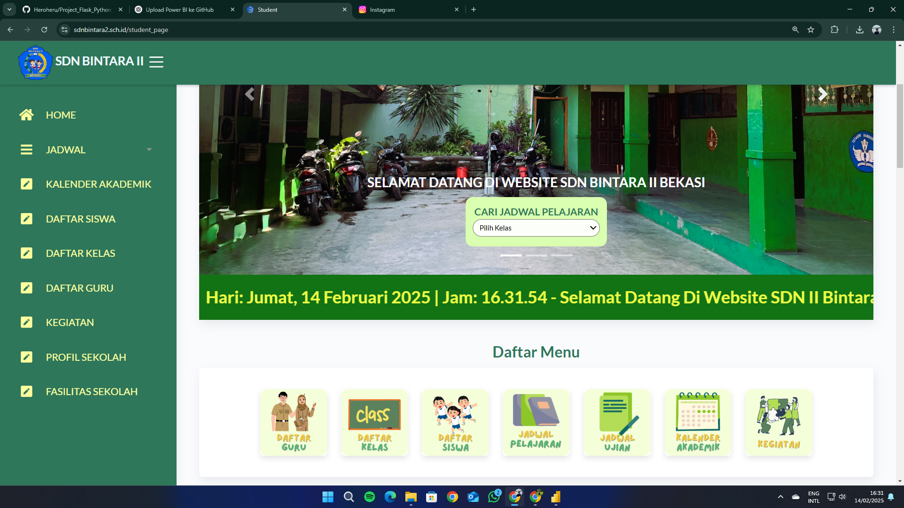

# Project_Flask_Python_Web_SD
🐍 Flask Python Web SD Project ini adalah aplikasi web berbasis Flask yang dikembangkan menggunakan Python untuk keperluan Sekolah Dasar (SD) Bintara 2 Kota Bekasi. Aplikasi ini dirancang untuk membantu pengelolaan data sekolah, guru, siswa, serta fitur-fitur pendukung lainnya.  

### **📷 Preview Web**  
  

✨ Fitur Utama
🔹 Manajemen Data: CRUD untuk siswa, guru, dan kelas
🔹 Autentikasi & Autorisasi: Login multi-user (admin, guru)
🔹 Authentikasi 2 faktor dengan email
🔹 Pengumuman: Penyampaian informasi sekolah secara real-time

🚀 Teknologi yang Digunakan
Backend: Flask (Python)
Frontend: HTML, CSS, Bootstrap
Database: mySQL

Website ini menggunakan dan memodifikasi tempate dari

Atlantis Dark Flask
Open-source Flask Dashboard generated by AppSeed on top of a modern Bootstrap design. Atlantis Dark is a free Bootstrap admin dashboard that is beautifully and elegantly designed to display various metrics, numbers, or data visualization. Atlantis Lite admin dashboard has 2 layouts, many plugins, and UI components to help developers create dashboards quickly and effectively so they can save development time and also help users to make the right and fast decisions based on existing data.

- 👉 [Atlantis Dark Flask](https://appseed.us/product/atlantis-dark/flask/) - Product page
- 👉 [Atlantis Dark Flask](https://flask-atlantis-dark.appseed-srv1.com/) - LIVE Demo

